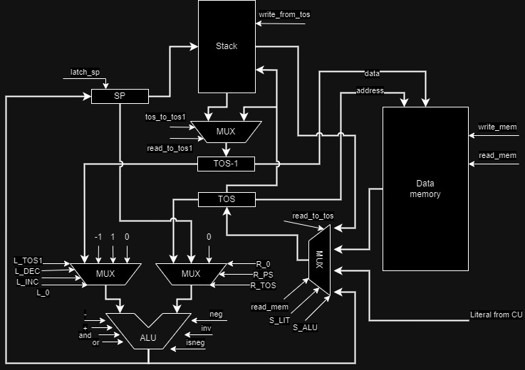
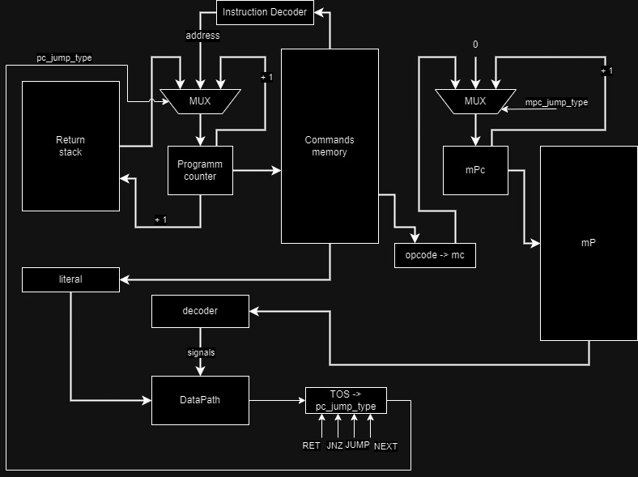
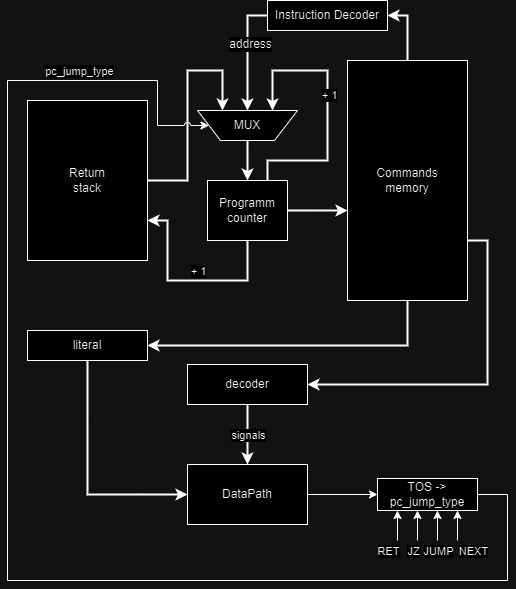

# Лабораторная работа №3 "Эксперимент"

## Вариант
```
forth | stack | harv | mc -> hw | tick -> instr | struct | stream | mem | pstr | prob1 | cache
```
 - Фролов Кирилл Дмитриевич P3206
 - ~~Базовый~~ Упрощенный вариант

### Расшифровка
   - Низкоуровневый язык ***Forth*** (с обратной польской нотацией и поддержкой процедур)
   - ***Стековая*** архитектура процессора
   - ***Гарвардская архитектура*** (раздельная память для команд и данных)
   - ~~Управление посредствам ***микрокода***~~ Управление реализуется как часть модели.
   - Симуляция с точностью до ~~***тактов***~~ ***инструкций***
   - Машинный код хранится как ***высокоуровневая структура***
   - ***Потоковый*** ввод-вывод (без прерываний)
   - Устройства ввода-вывода адресуются через ***память*** (без особых инструкций для ввода-вывода)
   - ***Pascal strings*** (длина строки + содержимое)
   - Project euler problem 1 (алгоритм для реализации на языке forth)
   - ~~Кэширование~~ (не реализовано)

## Оглавление
1. [Вариант](#вариант)
    - [Расшифровка](#расшифровка)
2. [Язык программирования](#язык-программирования)
   - [Синтаксис](#синтаксис)
   - [Семантика](#семантика)
   - [Литералы](#литералы)
   - [Типы аргументов](#типы-аргументов)
3. [Организация памяти](#организация-памяти)
4. [Система команд](#система-команд)
5. [Транслятор](#транслятор)
6. [Модель процессора](#модель-процессора)
7. [Тестирование](#тестирование)
8. [Общая статистика](#общая-статистика)

## Язык программирования

Реализуется подмножество языка Forth для программ из задания. [Сами программы](algorithms). 

### Синтаксис

```ebnf
<program> ::= <line>*

<line> ::= <instr> <comment>? "\n"
       | <comment>? "\n"

<instr> ::= <op> | <procedure_call>

<op> ::= <control_op>
      | <op-1-0>
      | <op-2-0>
      | <op-0-1>
      | <op-1-1>
      | <op-2-1>

<control_op> ::= "then"
      | "begin"
      | ":"
      | ";"
      | "("
      | ")"
      | "variable"
      | "allot"
      | "\""

<op-1-0> ::= "if"
      | "until"
      | "emit"
      | "."
      
<op-2-0> ::= "+!"
      | "!"

<op-0-1> ::= "dup"
      | "over"
      | "key"
      | <integer>

<op-1-1> ::= "@"

<op-2-1> ::= "+"
      | "-"
      | "="
      | "<"
      | ">"
      | "or"
      | "and"
      
<procedure_call> ::= <procedure_name>
<procedure_name> ::= <letter>*

<lowercase_letter> ::= [a-z]
<uppercase_letter> ::= [A-Z]
<letter> ::= <lowercase_letter> | <uppercase_letter>

<positive_integer> ::= [0-9]+
<integer> ::= "-"? <positive_integer>

<any_letter> ::= <lowercase_letter>
      | <uppercase_letter>
      | <integer>
      | " "

<comment> ::= " "* "/" " "* <any_letter>*
```

### Семантика
   - Код выполняется последовательно, одна инструкция за одной.
   - Список встроенных [инструкций](#система-команд).
   - Также же можно определять собственные процедуры:
     - Для этого нужно использовать ":" для начала определения процедуры;
     - Можно написать не влияющую на исполнение программы аннотацию сигнатуры: `(операнды -- возвращаемое значение)`; 
     - Написать название процедуры как непрерывную последовательность символов;
     - Написать последовательность инструкций литералов и вызовов процедур для определения тела процедуры;
     - Использовать ";" для завершения определения процедуры.
   - Процедуры используют встроенные инструкции или другие процедуры, поэтому также взаимодействуют со стеком.
   - Использовать одну процедуру можно неограниченное количество раз.

Пример определения процедуры:
```forth
:  my_procedure_name (op1, op2 -- result)
   other_procedure
   1
   +
;
```
`my_procedure_name` увеличит значение, полученное из `other_procedure`. Результат `result` останется на вершине стека, а `op1, op2`, вероятно, будут задействованы в `my_procedure_name`. 

### Литералы
   1. Любое целое число воспринимается как команда положить это число на вершину стека.
   2. Строка (область ограниченная `"`) воспринимается как инициализация строки в памяти. Ее можно вывести с помощью `.`. Пример этого в программе [hello world](algorithms/hello_world.fth).  

## Организация памяти

* Машинное слово – не определено. Инструкции хранятся в высокоуровневой структуре данных.
* Размер операнда – не определен. Интерпретируется как знаковое целое число.
* Адресация – прямая, абсолютная, доступ к словам. Адрес берется с вершины стека. Косвенную адресацию можно реализовать программно.
* Программист не взаимодействует с адресами памяти данных на прямую.
  Транслятор сам решает, в каком месте выделить память под программу и под данные программы.
* Программа и данные хранятся в раздельной памяти согласно Гарвардской архитектуре.
  Программа состоит из набора инструкций, последняя инструкция – `HALT`.
  Процедуры размещаются в той же памяти, они обязаны завершаться при помощи инструкции `RET`.
* Литералы - знаковые числа. Константы отсутствуют.

Организация стека:

* Стек реализован в виде высокоуровневой структуры данных (`array`)
* В data-path стек - это 2 регистра:
  * `TOS` - вершина стека
  * `TOS-1` - следующий за вершиной элемент (нужен для инструкций с двумя операндами или для инструкции over)
* Ячейка стека может уместить один операнд одной ячейки памяти.

## Система команд

Особенности процессора:

* Машинное слово – не определено.
* Тип данных - знаковые числа. Логические значения работаю как в C (`0` - `False`, все остальное - `True`). При выводе с помощью `emit` числу сопоставляется символ Unicode.
* Доступ к памяти осуществляется по адресу из вершины стека.
* Обработка данных осуществляется в стеке. Данные попадают в стек из:
  * Памяти. ___Устройства ввода-вывода привязаны к ячейкам памяти.___
  * С помощью инструкции LIT.
  * АЛУ кладет результат вычислений на вершину стека.
* Поток управления:
  * Значение `PC` инкриминируется после исполнения каждой инструкции;
  * Условный (`JNZ`) и безусловный (`JUMP`) переходы;
  * Микропрограммное управление - каждый такт выполняется одна микрокоманда и посредствам счетчика микрокоманд решается, какая станет следующей. 

Набор инструкций:

* `NOP` – нет операции.
* `LIT <literal>` – положить число на вершину стека.
* `LOAD { data_address }` – загрузить из памяти значение по адресу с вершины стека.
* `STORE { data_address, element }` – положить значение в память по указанному адресу.
* `DUP { element }` – дублировать элемент, лежащий на вершине стека.
* `OVER { e1 } [ e2 ]` – дублировать элемент, лежащий на 1 глубже вершины. Если в стеке только 1 элемент – поведение не определено.
* `ADD { e1, e2 }` – положить на стек результат операции сложения e2 + e1.
* `SUB { e1, e2 }` – положить на стек результат -e1.
* `AND { e1, e2 }` – положить на стек результат операции логического И.
* `OR { e1, e2 }` – положить на стек результат операции логического ИЛИ.
* `INV {e1}` - инвертировать логическое значение на вершине стека.
* `NEG {e1}` - домножить значение на вершине стека на -1.
* `ISNEG {e1}` - положить на вершину значение флага Negative.
* `JNZ { element } < program_address >` – если элемент не равен 0, начать исполнять инструкции по указанному адресу. Условный переход.
* `JUMP < program_address >` – безусловный переход по указанному адресу.
* `CALL < program_address >` – начать исполнение процедуры по указанному адресу.
* `RET` – вернуться из процедуры в основную программу, на следующий адрес.
* `HALT` – остановка тактового генератора.

Взятие операнда со стека - `{ op }`. \
Указание операнда в инструкции - `< op >`. \
Если операции требуется дополнительный операнд, но он не используется, он обозначен `[ в квадратных скобках ]`.

Если команда задействует операнд, то она снимает его со стека.
___Кроме команд `DUP` и `OVER`.___ \
Они читают, но не перемещают stack pointer после чтения и кладут дублируемое значение наверх.

Согласно [варианту](#вариант) машинный код хранится в высокоуровневой структуре. 
Это реализуется списком словарей (в python соответствуют json объектам).
Один элемент списка — это одна инструкция.
Индекс инструкции в списке – адрес этой инструкции в памяти команд.

Пример машинного слова:
```json
{
  "opcode": "LIT",
  "operand": 2
}
```

Где:
* `opcode` – строка с кодом операции
* `operand` – аргумент команды (обязателен для инструкций с операндом)

Система команд реализована в модуле [isa.py](/isa.py).

## Транслятор

Транслятор реализован в модуле [translator.py](/translator.py).
Формат запуска: `./translator.py <input_file> <target_file> ` 

Трансляция включает в себя:
  - Разбиение текста программы на токены
  - Удаление всех незначимых символов, считающихся комментариями 
    - внутри скобок - сигнатуры функции
    - после `/` и до конца строки - комментарий
  - Проверка формальной корректности программы 
    - Задача о правильной скобочной последовательности, только вместо скобок - парные операторы. (Функция check_balance_in_terms)
  - Поиск переменных, выделение памяти под них, отчистка списка токенов от инициализации переменных
  - Поиск функций
  - Конвертацию токенов в наборы инструкций
  - Составление из наборов инструкций кода
  - Замена номера _набора инструкций_ на номер _инструкции_ в адресах (для переходов с помощью `CALL` `JNZ` `JUMP`)

## Модель процессора

Формат запуска: `./vm.py <machine_code_file> <input_file>`

`DataPath` реализован в модуле [data_path.py](/data_path.py)



Описание сигналов DataPath:
  - `latch_sp` - защелкнуть регистр-указатель на вершину стека
  - `write_from_tos` - записать в стек значение из регистра TOS
  - `latch_tos1` - защелкнуть в регистр TOS1 значение из стека по указателю SP
  - `latch_tos_type` - определяет, что защелкнуть в TOS (2 бита обеспечивает 4 строки таблицы истинности)
    - `read_mem` - защелкнуть в регистр TOS значение из памяти по адресу в регистре TOS
    - `read_to_tos` - защелкнуть в регистр TOS значение из стека по указателю SP
    - `S_LIT` - защелкнуть в регистр TOS литерал из инструкции (см устройство literal в ContrlUnit)
    - `S_ALU` - защелкнуть в регистр TOS значение, посчитанное АЛУ
  - `write_mem` - записать в память по адресу из регистра TOS значение из регистра TOS1
  - `ALU_left_input` - определяет, что подать на левый вход АЛУ(2 бита обеспечивает 4 строки таблицы истинности)
    - `L_TOS1` - подать на левый вход АЛУ значение регистра TOS1
    - `L_DEC` - подать на левый вход АЛУ -1
    - `L_INC` - подать на левый вход АЛУ 1
    - `L_0` - подать на левый вход АЛУ 0
  - `ALU_right_input` - определяет, что подать на правый вход АЛУ (2 бита обеспечивает 4 строки таблицы истинности)
    - `R_TOS` - подать на левый вход АЛУ значение регистра TOS
    - `R_PS` - подать на правый вход АЛУ значение регистра-указателя на вершину стека
    - `R_0` - подать на правый вход АЛУ 0
  - `ALU_OP` - определяет операцию на АЛУ (3 бита обеспечивает 8 строк таблицы истинности)
    - `-` - выбрать операцию вычитания для АЛУ (левый вход - правый вход)
    - `+` - выбрать операцию сложения для АЛУ
    - `and` - выбрать операцию логического И для АЛУ
    - `or` - выбрать операцию логического ИЛИ для АЛУ
    - `neg` - АЛУ возьмет взаимно обратное по сложению число для правого входа
    - `inv` - АЛУ логически инвертирует правый вход
    - `isneg` - АЛУ выдаст -1, если на правом входе 0, и 0 иначе

~~`Control Unit` для `Microcoded` модели процессора реализован в модуле [machine_mc.py](/machine_mc.py).~~



`Control Unit` для `Hardwired` модели процессора реализован в модуле [machine_hw.py](/machine_hw.py).



Описание устройств ControlUnit:
  - `literal` - устройство, умеющее брать из команды аргумент, как литерал (число), и направляющее на мультиплексор TOS 
  - `instruction Decoder` - устройство, умеющее брать из команды аргумент, как адрес в командах перехода (`CALL` `JNZ` `JUMP`)
  - `TOS -> pc_jump_type` - устройство, получающее на вход значение TOS и тип перехода (`RET` `JNZ` `JUMP` `NEXT`), и выдающее нужный сигнал на мультиплексор `Program counter`-а
  - `opcode -> mc` - устройство, получающее код инструкции и возвращающее адрес ее реализацией в микрокоде. Только для базового варианта
  - `decoder`:
    - Базовый вариант - получает на вход код _микроинструкции_ и выдает нужные управляющие сигналы на DataPath и ControlUnit. Каждый такт новая микроинструкция, счетчик микроинструкций обновляется. Выполнение определяется памятью микрокоманд.
    - Упрощенный вариант - устройство, получающее на вход код _инструкции_ и выдающее нужные сигналы на DataPath и ControlUnit. Инструкции могут выполняться несколько тактов. Процесс выполнения зашит в этом устройстве.

## Тестирование

Тестирование осуществляется при помощи golden test-ов.
Настройки golden тестирования находятся в файле `tests/test_machine.py`.
Конфигурация golden test-ов лежит в директории `golden`.

- `cat` – повторяет поток ввода на вывод;
- `hello user` – печатает на выход приветствие пользователя;
- `hello world` – печатает на выход “Hello, world!”;
- `prob1` – сумма чисел от 1 до 1000, кратные 3 либо 5.

Запустить тесты можно с помощью:

```shell
cd python
poetry run pytest . -v
```

Пример тестирования:

will be there soon...

## Общая статистика

```text
| ФИО                      | алг            | LoC | code инстр. | инстр. | такт. | вариант                                                                                |
| Фролов Кирилл Дмитриевич | cat            | 8   | 16          | 81     | 285   | forth | stack | harv | mc -> hw | tick -> instr | struct | stream | mem | pstr | prob1 |
| Фролов Кирилл Дмитриевич | hello_username | 55  | 89          | 866    | 3383  | forth | stack | harv | mc -> hw | tick -> instr | struct | stream | mem | pstr | prob1 |
| Фролов Кирилл Дмитриевич | hello_world    | 2   | 17          | 137    | 573   | forth | stack | harv | mc -> hw | tick -> instr | struct | stream | mem | pstr | prob1 |
| Фролов Кирилл Дмитриевич | prob1          | 40  | 91          | 1000   | 3903  | forth | stack | harv | mc -> hw | tick -> instr | struct | stream | mem | pstr | prob1 |
```
